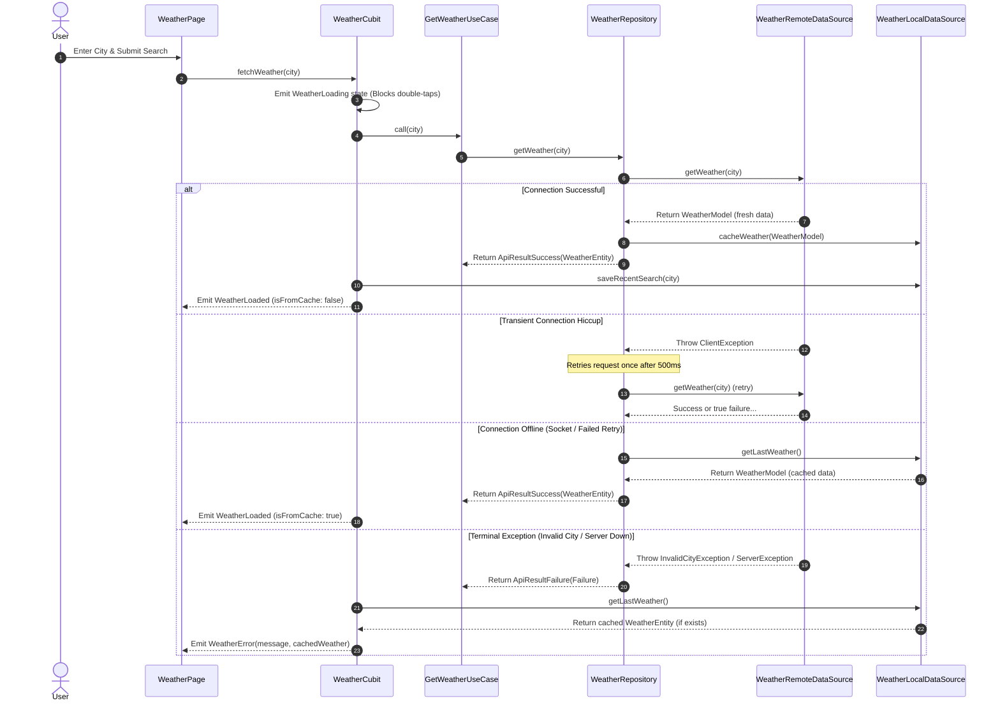

# 🌦️ LumiWeather — Weather App with Offline Cache

[](https://flutter.dev)
[](https://dart.dev)
[](https://pub.dev/packages/flutter_bloc)
[](https://pub.dev/packages/get_it)
[](https://pub.dev/packages/test)

A premium, highly responsive Flutter Weather Application designed with **Clean Architecture** boundaries, glassmorphism aesthetics, dynamic state management, local database caching, search history tracking, and intelligent offline fallback.

---

## 📸 Presentation & Visual Deliverables

### 🎬 App Demo Preview
Here is a complete screen recording demonstrating dynamic weather transitions, light/dark theme synchronization, validation, pull-to-refresh, error states, and offline cache fallbacks:

*   [**▶️ Watch the App Demo Video (Opens GitHub's Native Player)**](https://github.com/Fathi123-max/lumicore_task/blob/master/assets/2026-06-17%2012-02-52.mp4)

*(Note: Clicking the link above will open the video directly in GitHub's native web media player. Below is the inline preview)*


### 📥 Direct App Download
You can download and install the build directly from this repository:
*   [**Download app-release.apk**](https://github.com/Fathi123-max/lumicore_task/raw/master/app-release.apk)

---

## ✨ Features Checklist

| Feature | Description | Visual / Behavior Status |
| :--- | :--- | :--- |
| **🔍 Search City** | Instant lookup of international weather metrics. | Displays City, Temp, Humidity, Wind Speed & Conditions |
| **💾 Offline Cache** | Caches the last successfully searched city. | Displays "Offline Mode" banner with last cached timestamp |
| **🔄 Auto-Reconnect** | Automatically polls and refreshes weather as soon as network returns. | Zero manual reload required when connection is restored |
| **⏰ History Pills** | Horizontal pills displaying the last 10 unique searches. | Tap-to-reload city weather immediately |
| **🚨 Error Fallback** | Displays cached weather underneath the error warning. | Avoids empty error screens; always shows last known data |
| **🎨 Dynamic Themes** | centralizes background gradients according to active weather state. | Uses a custom `ThemeExtension` with 0 hardcoded widget colors |
| **🫧 Glassmorphism** | Translucent card panels with backdrop blur. | Premium, high-contrast, modern layout |
| **⏳ Shimmer loading** | Responsive shimmer skeletons matching card shapes. | Prevents layout jumps & blocks double-tap API abuse |

---

## 🛠️ System Architecture & Data Flow

This project strictly enforces **Clean Architecture** separating Presentation, Domain, and Data:

```
lib/
├── core/
│   ├── di/                 # Service locator setup using get_it
│   ├── error/              # Failure models & generic ApiResult contracts
│   └── theme/              # Centralized WeatherThemeExtension and ThemeData builders
└── features/
    └── weather/
        ├── data/           # Weather API DTOs, SharedPreferences local storage sources
        ├── domain/         # Pure Dart entities, use cases, repository interfaces (Zero Flutter dependencies)
        ├── presentation/   # Cubits, custom glassmorphism widgets, page layouts
```

### Flow Diagram: Dynamic Fetching & Cache Failover

The sequence below illustrates the failover sequence during searches and network losses:



---

## 🚀 Getting Started

### Prerequisites

*   Flutter SDK `v3.22.0` or higher
*   Dart SDK `v3.0.0` or higher

### Installation & Run

1.  **Clone the Repository:**
    ```bash
    git clone https://github.com/Fathi123-max/lumicore_task.git
    cd lumicore_task
    ```

2.  **Fetch Dependencies:**
    ```bash
    flutter pub get
    ```

3.  **Run with API Key Injection:**
    To ensure credential safety, the application injects the WeatherAPI key as an environment definition at compilation:
    ```bash
    flutter run --dart-define=WEATHER_API_KEY=YOUR_WEATHERAPI_KEY_HERE
    ```

---

## 🧪 Testing Coverage

The project is backed by **24 fully passing unit tests** validating edge cases, parsing, and caching rules:

```bash
flutter test
```

### Suite breakdown:

*   **`weather_cubit_test.dart` (7 tests):** Evaluates loading/loaded transitions, duplicate submission blocking, validation errors, and cache injection inside errors.
*   **`weather_repository_test.dart` (9 tests):** Validates caching behavior, offline SocketException fallback, HTTP client exception retries, and failure mappings.
*   **`weather_model_test.dart` (8 tests):** Inspects JSON schema conversion, double-to-integer coercion, local cache serialization/deserialization, and null-fallback safety.
